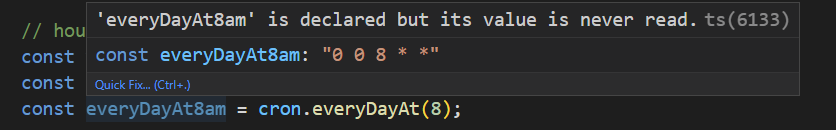

# Cron-Toolkit-Ts
Generate a cron expression from a human readable function. with the type-safe way.


## Install

```bash
npm i cron-toolkit-ts
```

## Usage

### Minutes
```ts
import { Cron } from 'cron-ts';

const everyMinute = Cron.everyMinute(); // 0 * * * * *

const every5Minutes = Cron.everyMinutes(5); // */5 * * * *

const every10Minutes = Cron.everyMinutes(10); // */10 * * * *

const every15Minutes = Cron.everyMinutes(15); // */15 * * * *

const every30Minutes = Cron.everyMinutes(30); // */30 * * * *

const every45Minutes = Cron.everyMinutes(45); // */45 * * * *

const customMinutes = Cron.everyCustomMinutes(14); // */14 * * * *

```


### Hours
```ts
const everyHour = Cron.everyHour(); // 0 * * * * every hour at minute 0
const every2Hours = Cron.every2Hours(); // 0 */2 * * *  every 2 hours at minute 0
const every3Hours = Cron.every3Hours(); // 0 */3 * * * every 3 hours at minute 0
const every6Hours = Cron.every6Hours(); // 0 */6 * * * every 6 hours at minute 0
const every12Hours = Cron.every12Hours(); // 0 */12 * * * every 12 hours at minute 0
const everyCustomHour = Cron.everyCustomHour(14); // 0 */14 * * * every 14 hours at minute 0

```

### Days
```ts
const everyDay = cron.everyDay().get(); // 0 0 * * * every day at 00:00
const everyDayAt12pm = Cron.everyDayAt(12) // 0 12 * * * every day at 12:00
const everyDayAt12pm = Cron.everyDay().atHour(12).get() // 0 12 * * * every day at 12:00
const everyDayAt1230Hours = Cron.everyDay().atHour(12).atMinute(30) // 30 12 * * * every day at 12:30
const everyDayAt12am = Cron.everyDayAt(0) // 0 0 * * * every day at 00:00
const weekDaysAt8pm = Cron.fromDay("Monday").toDayAt("Friday", 20); // 0 20 * * 1-5 every week days at 20:00
const inWeekendAt9am = Cron.fromDay("Saturday").toDayAt("Saturday", 9); // 0 9 * * 6-0 every weekend at 09:00

```

### During the day
```ts
const atNoon = Cron.atNoon(); // 0 12 * * * every day at 12:00
const atNight = Cron.atNight(); // 0 21 * * * every day at 21:00
const atMorning = Cron.atMorning(); // 0 9 * * * every day at 9:00
const atEvening = Cron.atEvening(); // 0 18 * * * every day at 18:00
const atAfternoon = Cron.atAfternoon(); // 0 15 * * * every day at 15:00
const atStartOfTheDay = Cron.atStartOfTheDay(); // 0 0 * * * every day at 00:00
```

### Months
```ts
const everyMonth = Cron.everyMonth().get(); // 0 0 1 * * every month at 1st day at 00:00
const everyJanuary = Cron.atMonth(1) // 0 0 1 1 * every January 1, at 00:00
const everyJanuaryTwelfth = Cron.everyMonth().onDay(12).get() // 0 0 12 * * every January 12 at 00:00
const everyJanuaryTwelfthAt1am = Cron.everyMonth().onDay(12)
                                  .atHour(1).get() // 0 1 12 * * every January 12 at 01:00
const everyJanuaryTwelfthAt0130Hours = Cron.everyMonth().onDay(12)
                                  .atHour(1).atMinute(30) // 30 1 12 * * every January 12 at 01:30
```

## Non-standard cron expressions

### Seconds

```typescript
const every5Seconds = cron.useNonStandard().everyCustomSecond(5);
const every10Seconds = cron.useNonStandard().every15Seconds();
const every45Seconds = cron.useNonStandard().every45Seconds();
```